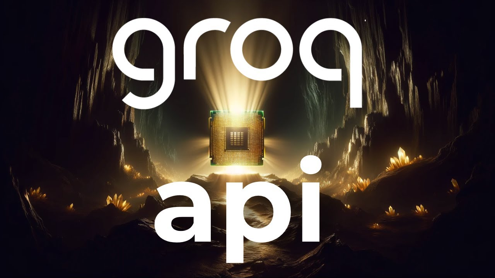

<h2>AI-Powered API for Real-Time Interactions</h2>

<h3>Installation</h3>

To get started, you'll need to install the required packages using pip:

<pre><code>pip install groq requests flask</code></pre>

Next, set your <code>GROQ_API_KEY</code> environment variable:

<pre><code>export GROQ_API_KEY=xxxxxxxxxxx</code></pre>

<h3>Running the Application</h3>

Once installed, you can start the application by running the Flask server. Then, you can test it by sending a request to <code>http://127.0.0.1:5000/score?team=lakers</code> using <code>curl</code> or a similar tool:

<pre><code>curl http://127.0.0.1:5000/score?team=lakers</code></pre>

<h3>What You Will Learn</h3>

This project covers the following topics:

<ul>
  <li>Setting up a virtual environment with Gro Python 3.11.</li>
  <li>Creating an API using Flask for handling data requests.</li>
  <li>Integrating an AI application with the API using Llama 3.</li>
  <li>Designing a user-friendly interface for real-time AI interactions.</li>
</ul>

<h3>Setup Steps</h3>

To set up the project, follow these steps:

<ol>
  <li>Initialise and activate the virtual environment.</li>
  <li>Install necessary packages like Flask, Gradio, Requests.</li>
  <li>Code along as we build the API and link it with our AI application.</li>
  <li>Launch the application and test it through a user interface.</li>
</ol>

By following these steps, you'll have a fully functional AI-powered API for real-time interactions.

